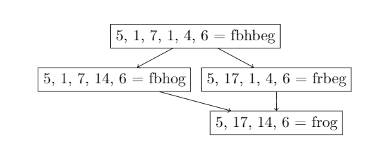
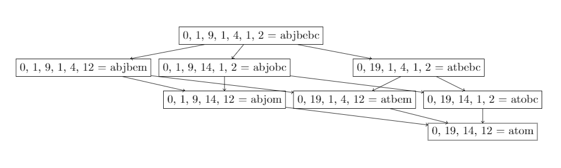

ambiguous-code-enumeration
==========================

A pedantic, tree-based approach to an imaginary decoding problem.

Problem setup
-------------

Say you have invented a cool new coding scheme for encoding single words. To
encode a word, such as 'frog', you break it up into its individual letters, and
assign each letter to a number according to its position in the alphabet ('a' is
0, 'b' is 1, etc.). For 'frog', we get 'f'=5, 'r'=17, 'o'=14, 'g'=6. You then
concatenate the numbers together into a string digit-by-digit, so that 'frog'
becomes '517146'. After encoding all your words in this fashion, you realize
that your code cannot be decoded unambiguously, because there are no separators
and each letter in the original word could be encoded into either one or two
digits. As a first step towards decoding your words, you propose to enumerate
all possible legal decodings of the encoded representation, in hopes that you
could then search that list for real English words or something similar.

Tree-based approach
-------------------

There are probably many ways to perform this enumeration, but for the sake of
the argument, let's say you decide to do it using a tree.

Let each node of the tree represent one possible legal decoding of the encoded
representation. Decodings can be specified by inserting separators into the
number representation. Decodings are legal if and only if all the separated
numbers are less than or equal to the size of the alphabet.

Our goal will be to find all such nodes (and therefore all legal decodings) by
expanding a tree.

Let the root node be the decoding created by separating every digit of the
number representation to be decoded as its own character. This root node always
represents a legal decoding (proof is left as an exercise for the reader).

Allow child nodes to be created by removing one separator from the parent node,
as long as the resulting decoding is legal.

We can then expand the tree starting from the root node using this descendent
rule recursively to find all nodes that satisfy the desired property.

Examples
--------

### 'frog'

    $ python client.py 517146
    "5, 1, 7, 1, 4, 6 = fbhbeg" -> "5, 1, 7, 14, 6 = fbhog";
    "5, 1, 7, 14, 6 = fbhog" -> "5, 17, 14, 6 = frog";
    "5, 17, 1, 4, 6 = frbeg" -> "5, 17, 14, 6 = frog";
    "5, 1, 7, 1, 4, 6 = fbhbeg" -> "5, 17, 1, 4, 6 = frbeg";
    
The output printed to the console is in a tkiz-compatible format, so we can draw
the graph using the following LaTeX:

    \documentclass{article}
    \usepackage{tikz}
    \usepackage{pdflscape}
    \usetikzlibrary{graphs,graphdrawing,quotes}
    \usegdlibrary{trees}
    \begin{document}
    \begin{landscape}
    \tikz \graph [tree layout, nodes = {rectangle, draw}, circular placement, radius = 3cm] {
    "5, 1, 7, 1, 4, 6 = fbhbeg" -> "5, 1, 7, 14, 6 = fbhog";
    "5, 1, 7, 14, 6 = fbhog" -> "5, 17, 14, 6 = frog";
    "5, 17, 1, 4, 6 = frbeg" -> "5, 17, 14, 6 = frog";
    "5, 1, 7, 1, 4, 6 = fbhbeg" -> "5, 17, 1, 4, 6 = frbeg";
    };
    \end{landscape}
    \end{document}

which compiles to the following output:

### 'atom'

A notable edge case is that words that start with the first letter of the
alphabet (which encodes to '0') will be encoded to number strings that start
with '0'. Therefore, we really need the encoded representation to be a string of
numbers to allow encoded represenatations to start with '0'.

As an example of this in action, consider 'atom', which encodes to '0191412':

    $ python client.py 0191412
    "0, 1, 9, 1, 4, 1, 2 = abjbebc" -> "0, 1, 9, 1, 4, 12 = abjbem";
    "0, 1, 9, 1, 4, 12 = abjbem" -> "0, 1, 9, 14, 12 = abjom";
    "0, 1, 9, 14, 1, 2 = abjobc" -> "0, 1, 9, 14, 12 = abjom";
    "0, 1, 9, 14, 12 = abjom" -> "0, 19, 14, 12 = atom";
    "0, 19, 1, 4, 12 = atbem" -> "0, 19, 14, 12 = atom";
    "0, 19, 14, 1, 2 = atobc" -> "0, 19, 14, 12 = atom";
    "0, 1, 9, 1, 4, 12 = abjbem" -> "0, 19, 1, 4, 12 = atbem";
    "0, 19, 1, 4, 1, 2 = atbebc" -> "0, 19, 1, 4, 12 = atbem";
    "0, 1, 9, 1, 4, 1, 2 = abjbebc" -> "0, 1, 9, 14, 1, 2 = abjobc";
    "0, 1, 9, 14, 1, 2 = abjobc" -> "0, 19, 14, 1, 2 = atobc";
    "0, 19, 1, 4, 1, 2 = atbebc" -> "0, 19, 14, 1, 2 = atobc";
    "0, 1, 9, 1, 4, 1, 2 = abjbebc" -> "0, 19, 1, 4, 1, 2 = atbebc";

After inserting this output into our LaTeX template from above, this compiles to
the following output:

Note that we need to explicitly disallow merging `0, 19` ('at') into `019` ('t')
by removing the separator, because this just drops a zero (in this case, an 'a')
from the word.
